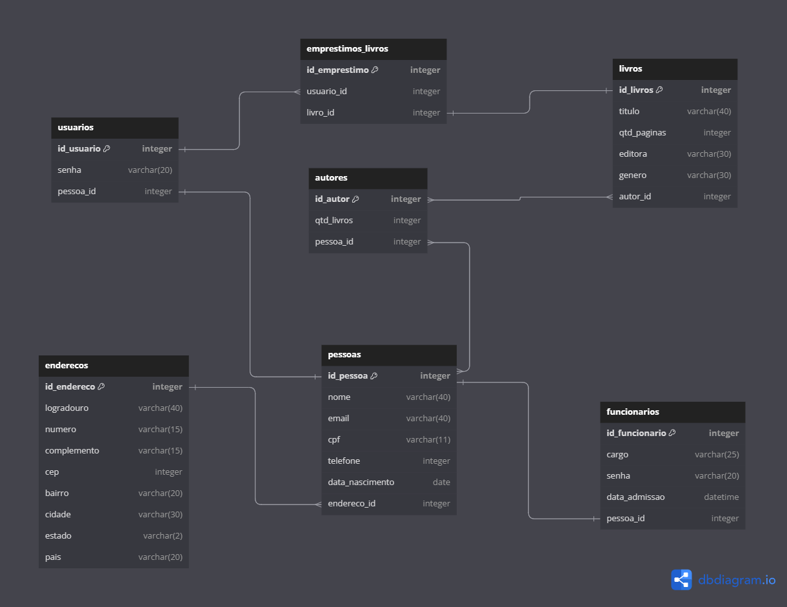
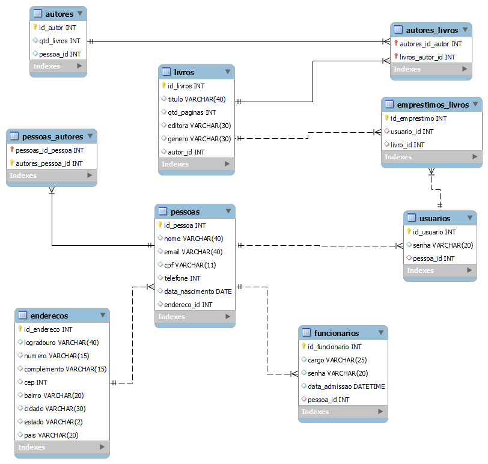

# Biblioteca Resilia

## Descrição

Biblioteca Resilia é um projeto desenvolvido como parte do módulo 3 do curso de Desenvolvimento Web Full Stack da Resilia Educação. Essa aplicação é um sistema de gerenciamento de biblioteca, que permite a administração de livros, autores, funcionários, usuários e empréstimos de livros.

## Funcionalidades

- Cadastro e gerenciamento de livros, incluindo informações como título, quantidade de páginas, editora e gênero.
- Cadastro e gerenciamento de autores, com a quantidade de livros publicados por cada autor.
- Cadastro e gerenciamento de funcionários da biblioteca, incluindo cargo, senha e data de admissão.
- Cadastro e gerenciamento de usuários do sistema, que podem realizar empréstimos de livros.
- Registro de empréstimos de livros, associando-os aos usuários e aos livros emprestados.
- Cadastro e gerenciamento de informações de pessoas, incluindo nome, email, CPF, telefone, data de nascimento e endereço.

## Tecnologias Utilizadas

- Linguagem de programação: SQL (Structured Query Language)
- Sistema de Gerenciamento de Banco de Dados: MySQL

---

## Modelagem

DBDiagram</img>

WorkBranch</img>
